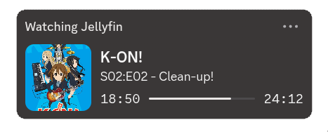

## jellyrpc

a simple jellyfin discord rpc daemon written in golang

wrote this because I was originally going to fork one of the existing solutions for this and make tweaks to suit my needs, but I came to the conclusion it was far easier to just rewrite it (and in a language I prefer)

<p align="center">
  
    
</p>


```
features:
  - configuration file
  - cover art fetching
  - pause state handling
  - efficient socket mgmt
  - systemd user service
```

### install

> requires `go` and `make`

```
git clone https://github.com/reckedpr/jellyrpc

cd jellyrpc

make install
```

#### config

edit the config file at `~/.config/jellyrpc/config` (the makefile should create this automatically)

edit the following values:

- `JELLYFIN_URL` with your jellyfin instance, ensuring you include the protocol
- `JELLYFIN_KEY` with an api key generated under dashboard > api keys
- `JELLYFIN_USER` with the jellyfin username of who you want to use the status of

now you can run `systemctl --user enable --now jellyrpc` to start the daemon

if you have any problems run `journalctl --user -u jellyrpc -n 20` and make an issue
